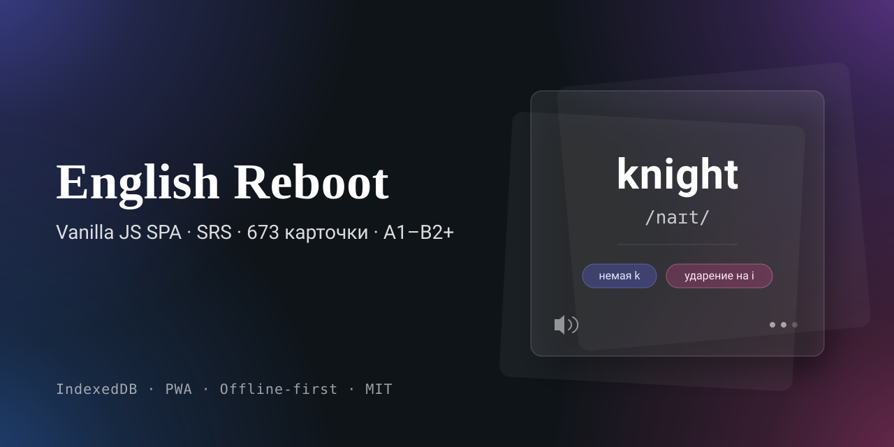
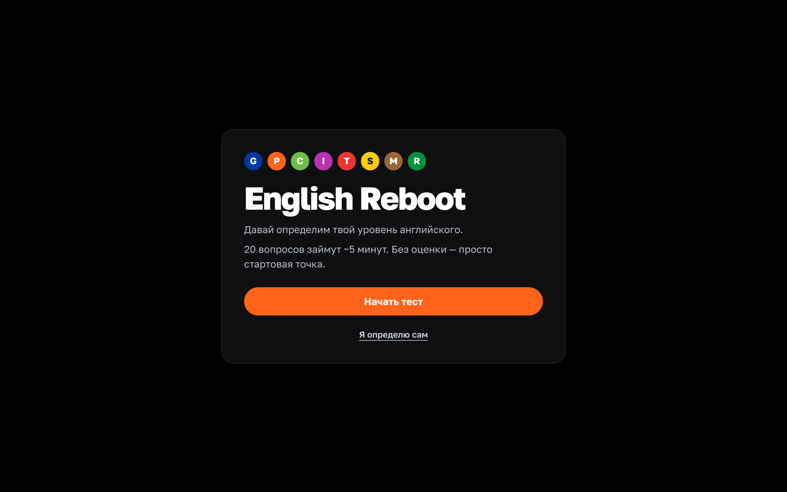
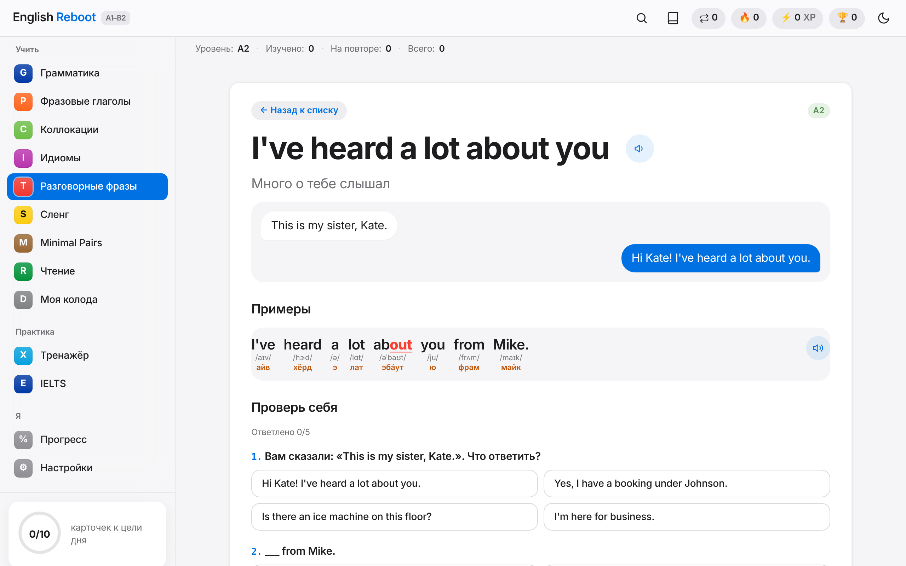
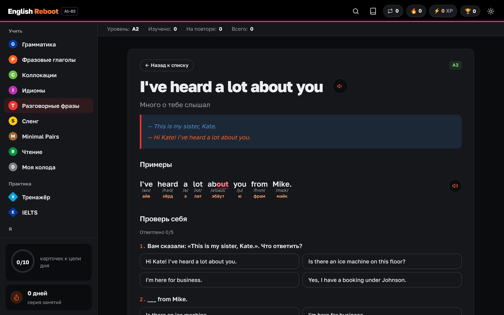
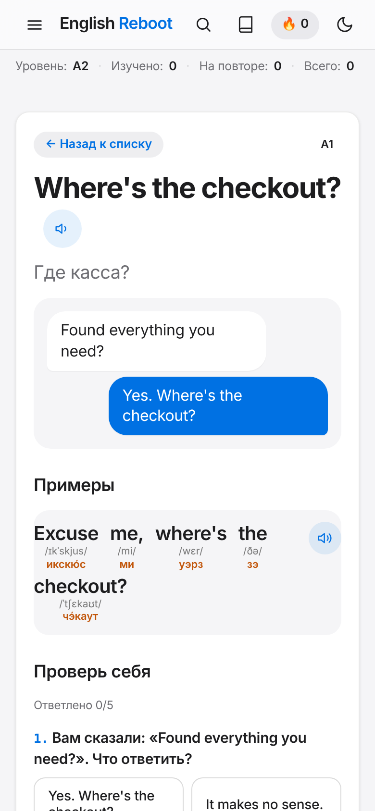
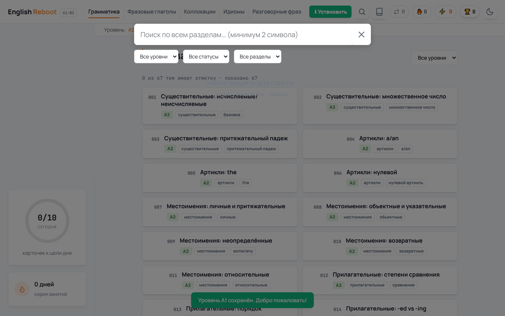

# English Reboot — SPA для изучения английского (A1–B2+)

[](CHANGELOG.md)


[](https://github.com/konstantin532/English-Reboot/actions/workflows/ci.yml)

**English Reboot** — это офлайн‑SPA для самостоятельного изучения английского языка. Приложение работает полностью в браузере без сервера: хранение прогресса, алгоритм интервальных повторений FSRS (как в Anki), тренажёры и контент — на чистом Vanilla JS и IndexedDB.

Проект создан в рамках портфолио QA‑инженера: здесь совмещены обучение английскому и практика автоматизации, тестирования и разработки SPA без сборщиков.

История изменений — в [CHANGELOG.md](CHANGELOG.md). Текущая версия: **1.0.0**.

## 📸 Скриншоты

| | |
|:---:|:---:|
|  |  |
|  |  |
|  | |

## 🎯 Цели проекта

- **Обучение английскому**: грамматика, лексика, фразовые глаголы, коллокации, идиомы, чтение, аудирование, диктанты, shadowing.
- **Практика QA и автоматизации**: валидация данных, обработка ошибок, офлайн‑режим, PWA, локальные уведомления, экспорт/импорт, автобэкапы.
- **Vanilla JS SPA**: без сборщиков, без фреймворков, один HTML‑файл как точка входа, модульные JS‑файлы.
- **Доступность и UX**: A11y, клавиатурная навигация, пустые состояния, адаптив, светлая/тёмная тема.

## 📚 Функционал

- **FSRS‑4.5** — модель памяти, как в Anki: у каждой карточки «стабильность» и «сложность», интервал подбирается так, чтобы вспомнить с вероятностью ~90%. На странице «Прогресс» — метрика «Память сегодня».
- **Русская транскрипция** под каждым словом примеров — как звучит в США (car → *кар*, water → *у́отэр*), с ударением. Американская IPA есть у 100% слов (CMU Pronouncing Dictionary); у омографов (live, close, read, use, wind) — вариант по смыслу предложения: «I live» — /lɪv/, «Close the door» — /kloʊz/.
- **Озвучка, которая работает всегда**: голос системы офлайн; если английского голоса нет (частый случай на русской Windows) — живые записи носителей для слов и онлайн-синтез для фраз. Нажми на любое слово — услышишь его. Диагностика в «Настройки → Звук».
- **Онбординг**: входной тест из 20 вопросов для определения уровня (A1–B2).
- **IELTS-подготовка** (Academic): Writing Task 1/2 с таймером, счётчиком слов, автоанализом (связки, AWL, повторы, сокращения), самооценкой по 4 критериям band descriptors и промптом для ИИ-экзаменатора; Speaking Part 1–3 (таймер 1+2 мин, запись голоса); Reading True/False/Not Given; Academic Word List.
- **Тренажёры**: диктант, теневой повтор (shadowing), карточки с разметкой (IPA, части речи, немые буквы, ударения, connected speech).
- **Поиск по всему контенту** (Ctrl+K) с фильтрами по уровню и разделу.
- **Гамификация**: XP, комбо, челленджи дня, лига, 12 достижений, календарь, история занятий.
- **PWA и офлайн**: Service Worker, манифест, установка на устройство.
- **Экспорт/импорт данных**: JSON‑бэкап, QR‑синхронизация (настройки + сводка), экспорт в Anki/Quizlet.
- **Автобэкапы** в localStorage каждые 7 дней + восстановление при повреждении IndexedDB.
- **Напоминания**: in‑app баннер + локальные уведомления (Android, Chrome).

## 🧠 Контент (3252 карточки)

- **Слова: 748 слов A1–A2** в 19 темах + 78 глаголов A2 с тремя формами (60 неправильных по группам, 18 правильных по звучанию -ed) (еда, семья, дом, город, время, магазин, здоровье, чувства, планы, поездки…) —
  у каждого перевод, часть речи, американская IPA, два своих примера с переводом и 5 вопросов.
  В уроке «Сегодня» — до 5 слов: сначала повторение по FSRS, потом новые своего уровня. Слова A1+ — с заданиями
  в духе LinguaLeo: собери из букв, напиши на слух, выбери по русскому.
- Грамматика: 67 тем (A1–B2, из них 12 PRO-тем уровня B2).
- Фразовые глаголы: 297 карточек (60 — A1+, 30 — A2 в прошедшем); фильтр «неправильные / правильные» и формы на плитке.
- Коллокации: 207 (make/do, take/have, adj+noun).
- Идиомы: 108 (темы: работа, финансы, эмоции).
- Разговорные фразы: 1645, из них **1503 — американская разговорная речь** в 41 теме (кафе, работа, созвоны, свидания, деньги, здоровье…), включая 8 тем A1 «Первая неделя» (еда и кафе, числа и время, город, о себе, дом и соседи, магазин, здоровье, звонки и сообщения) и 8 тем A1+ «Первый месяц» (gonna, wanna, gotta, kinda, lemme, вчера, могу и не могу, мнения, как часто) — у сокращений видна полная форма — и 5 тем A2 «Что было» (выходные, что случилось, рассказ, вопросы о прошлом, реакции).
- Импровизация: 165 ситуаций (50 — A1, 50 — A1+, 25 — A2) и 15 историй «Yes, and…».
- Сленг и живая речь: 110 карточек (70 сокращений, 20 междометий и слабых форм A1+ и 20 форм A2: whadja, meetcha, 'scuse me…).
- Minimal pairs: 47 (40 пар + 7 звуков).
- Тексты для чтения: 23 (диалоги, статьи, объявления) с вопросами.
- «Моя колода»: собственные карточки, импортированные из Anki.

Контент хранится в отдельных JS‑файлах (`content_*.js`) и загружается в IndexedDB при первом запуске.

План «+4000»: ещё 4000 карточек по подуровням A1 → A1+ → A2 → A2+ → B1 → B1+ → B2 → B2+, больше всего —
на A1–A2. Табло: `node scripts/content_stats.mjs` (сейчас 1503 из 4000: A1 и A1+ собраны целиком, A2 — 253 из 550).

## 🛠 Технологии и стек

- HTML5, CSS3 (без препроцессоров).
- Vanilla JavaScript (ES6+).
- IndexedDB (18 хранилищ) + localStorage.
- Service Worker для офлайн‑кэширования.
- SpeechSynthesis API (озвучка), MediaRecorder API (shadowing).
- QR‑код генерируется локально (библиотека qrcode-generator, MIT) — работает офлайн.
- PWA: manifest.json, standalone‑режим.
- A11y: aria‑labels, контрасты, фокус, роль диалогов.

## 📁 Структура проекта


```
English-Reboot/
├── index.html              точка входа
├── manifest.json           PWA-манифест
├── sw.js                   Service Worker (обязательно в корне — иначе не перехватит index.html)
├── css/style.css           стили, светлая / тёмная / AMOLED темы
├── js/
│   ├── db.js               IndexedDB: 19 хранилищ, CRUD
│   ├── srs.js              интервальные повторения, серия, прогноз
│   ├── app.js              ядро: состояние, мост window.ER, запуск, навигация
│   ├── app_ui.js           тема, боковая панель, шапка и меню, тосты, подтверждения
│   ├── app_library.js      грамматика, словарные разделы, карточки, Minimal Pairs, чтение
│   ├── app_session.js      SRS-кнопки, тренажёр, SRS-сессия, тесты карточек
│   ├── app_progress.js     вкладка «Прогресс»
│   ├── app_settings.js     настройки, звук, экспорт, сброс и очистка
│   ├── content_*.js        учебный контент (grammar, vocab, extra, pro, us, words)
│   ├── gamify.js           XP, комбо, челленджи, лига, импорт Anki
│   ├── dictation.js        диктант
│   ├── shadowing.js        теневой повтор + запись голоса
│   ├── tts.js / annotate.js озвучка и слои разметки
│   ├── search.js           поиск Ctrl+K
│   ├── onboarding.js       входной тест
│   ├── achievements.js / effects.js
│   ├── exportImport.js / backup.js / notifications.js
│   └── qrcode.js           генератор QR (MIT, Kazuhiko Arase)
├── English_Reboot.bat      запуск локального сервера (Windows)
└── Остановить_сервер.bat
```


## ▶️ Запуск

Откройте `English_Reboot.bat` (нужен Python или Node.js) — приложение откроется на http://localhost:8000.
Лаунчер запускает `scripts/serve.py` (правильные MIME-типы, без устаревшего кэша) и сам открывает браузер, когда сервер готов.

**Самый приятный голос** — в Microsoft Edge: там бесплатно доступны нейронные голоса Ava, Andrew, Emma, Aria, Jenny (нужен интернет). Приложение выбирает лучший голос само; проверить и сменить — «Настройки → Звук».
Без сервера (двойной клик по `index.html`) всё тоже работает, кроме установки PWA и офлайн-режима.

При изменении любого файла приложения увеличьте `CACHE_VERSION` в `sw.js`, иначе браузер может показывать старую версию из кэша.

## 🧪 Тесты и CI

- **Юнит-тесты** — Vitest, 44 случая: FSRS (`srs.test.js`), русская транскрипция (`annotate.test.js`), цепочка озвучки с подменой голосов и аудио (`tts.test.js`), целостность всего контента — 5000+ вопросов, 100% IPA (`content.test.js`), анализ эссе IELTS (`ielts.test.js`).
- **E2E** — Playwright, 10 сценариев: загрузка без ошибок, онбординг, навигация, прогресс после перезагрузки (`smoke.spec.js`); меню-«карта линий», транскрипция и озвучка по клику, FSRS, «Звук», IELTS, **работа офлайн после первого запуска** (`features.spec.js`).
- **Скриншоты** — автогенерация иллюстраций README (`npm run test:screenshots`).
- **CI** — GitHub Actions (`.github/workflows/ci.yml`): unit → E2E → переснятие скриншотов → сборка и проверка сайта (`scripts/build-pages.mjs`) на каждом PR; артефакты 7 дней. Публикация на GitHub Pages — `.github/workflows/deploy-pages.yml`, только после зелёного CI на `main`.

Локальный запуск: `npm test` · `npx playwright test` · `npm run test:screenshots`

## 📝 Изменения 1.1

- Исправлено: кнопки «Знаю/Сложно» блокировались после отметки, SRS-сессия не листалась (`renderLeagueInto is not defined`).
- Исправлено: `content_pro.js` не загружался из-за синтаксической ошибки — PRO-контент B2 теперь доступен.
- Исправлено: авто-бэкап при каждом запуске мог затирать свежий прогресс недельной копией.
- Исправлено: в 106 карточках «Разговорных фраз» у 2 вопросов не было правильного ответа.
- Исправлено: Service Worker не регистрировался (лежал в `js/`, пути кэша неверные) — офлайн-режим заработал.
- Исправлено: QR-синхронизация (Google Charts QR API отключён) — теперь генерируется локально.
- Исправлено: тема AMOLED (тёмный текст на чёрном), челленджи дня, звуки, «Текст дня», недельный обзор поверх онбординга, Escape в сессии, двойной Enter в диктанте, PRO-достижения, заморозка серии.
- Новое: раздел «Моя колода» для карточек из Anki; варианты ответов перемешиваются; длинные тексты озвучиваются без обрыва.

## 🗺 Roadmap

- [x] FSRS-алгоритм — адаптивные интервалы вместо фиксированной цепочки SRS
- [ ] Экспорт прогресса и карточек в CSV
- [ ] Локализация интерфейса (RU/EN)
- [ ] Обновление контента
